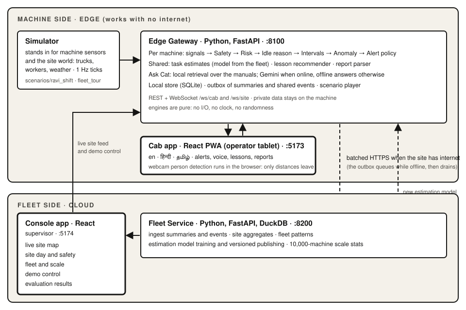
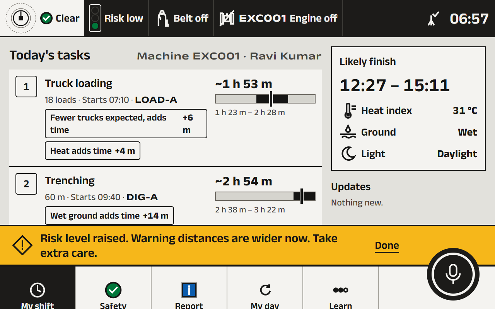
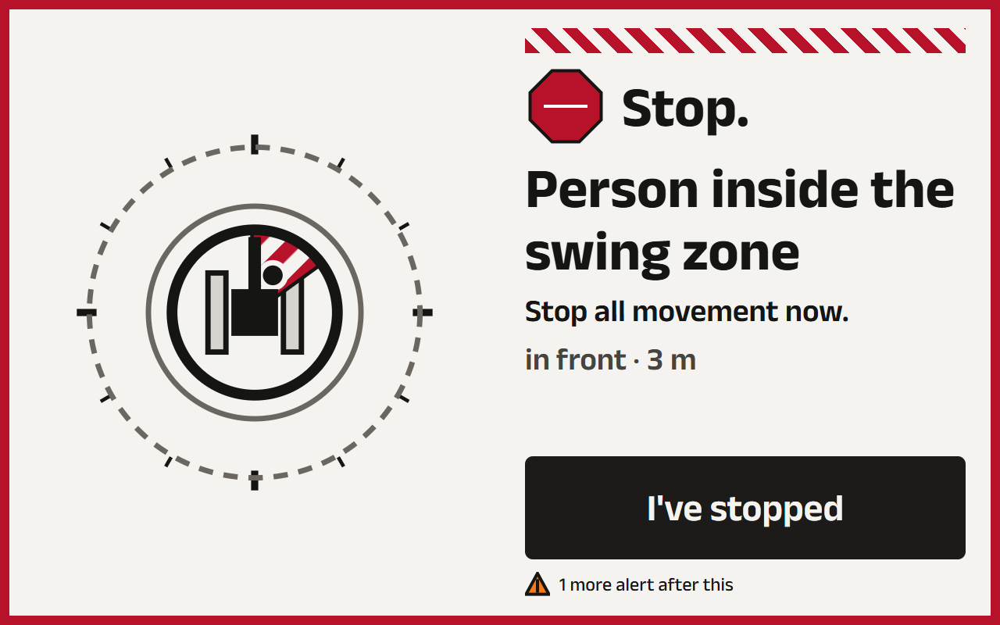
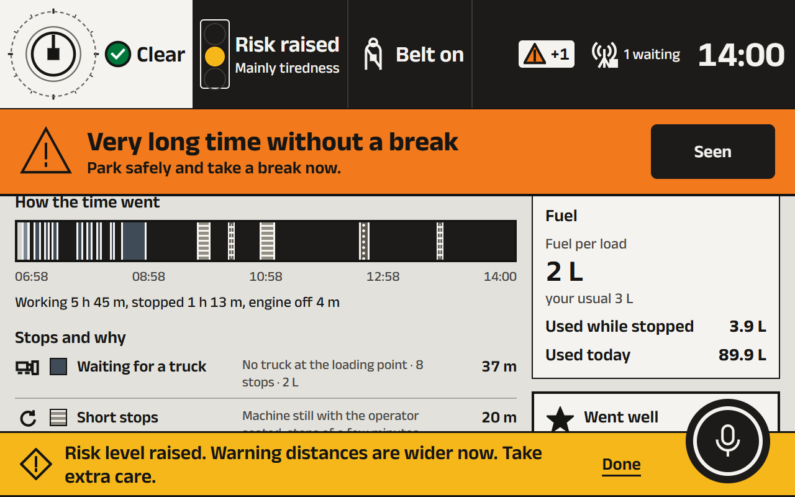
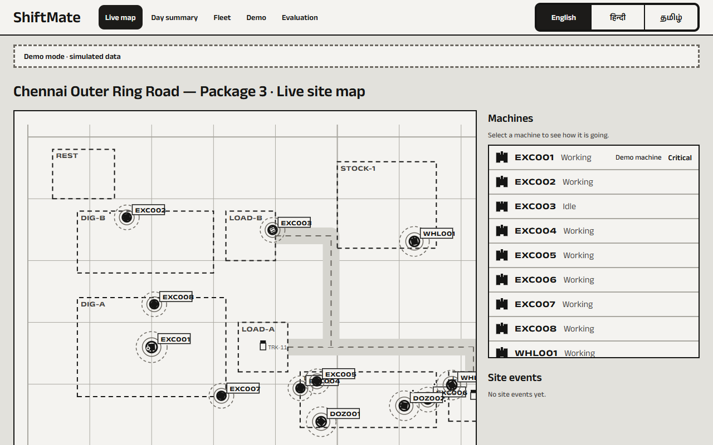
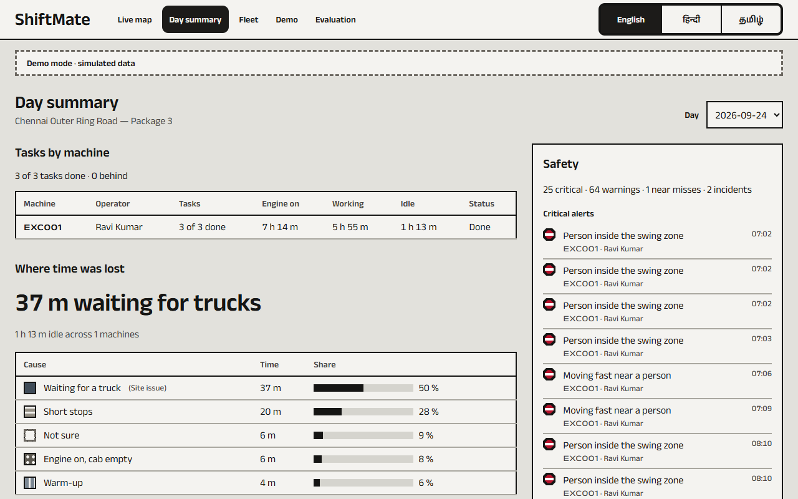
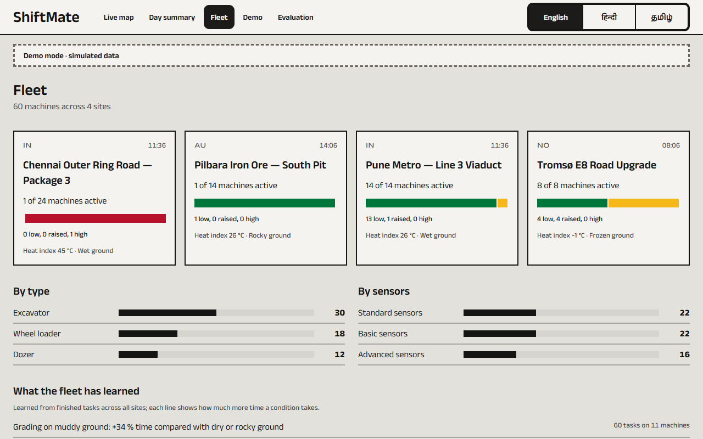

# ShiftMate

An operator-first, in-cab companion for Caterpillar machines, built for a Caterpillar hiring hackathon ("Smart Operator Assistant for CAT machinery"). It looks out for the operator; it does not watch them.

> **Status:** working prototype. See [docs/PROGRESS.md](docs/PROGRESS.md) for the build log and [docs/EVAL.md](docs/EVAL.md) for measured results.



> Sample manual content written for this prototype. A production system would use official Cat Operation & Maintenance Manuals. "Cat" is used only descriptively (for example "Cat 320"); no logos or trade dress.

## Screenshots

Cab app at 1280 × 800 and the supervisor console, during Ravi's shift (captured with `node scripts/screenshots.mjs` while `pnpm dev:all` runs).

| | |
|---|---|
|  |  |
| My Shift: task ranges and plain reasons | Worker in the swing zone: P1 takeover |
|  |  |
| End of shift: Ravi's private My Day | Console: live site map |
|  |  |
| Console: day summary for the supervisor | Console: fleet overview and scale |

## What is in the repository

| Folder | What it holds |
|---|---|
| `docs/` | PRD (what and why), TRD (how), DESIGN (visual system), DECISIONS (decision log), PROGRESS (build plan), EVAL (measured results, generated) |
| `config/` | Every threshold, rule, site, machine profile and lesson, as YAML |
| `scenarios/` | Scripted demo scenarios (`ravi_shift`, `fleet_tour`) |
| `knowledge/` | Team-written manual content for the assistant |
| `fixtures/` | The brief's four sample rows, verbatim |
| `backend/` | Python: edge gateway, fleet service, simulator, engines, assistant, evaluation |
| `frontend/` | React: cab app, console app, shared UI, contracts, translations |

## Requirements

- Windows 10/11 (PowerShell) or any bash shell
- Python 3.12 managed by [uv](https://docs.astral.sh/uv/)
- Node.js 20 or newer and [pnpm](https://pnpm.io/)
- Google Chrome (demo browser: speech and camera)

Install the two tools once, if you do not have them:

```powershell
winget install --id astral-sh.uv -e
npm install -g pnpm
```

Open a **new** PowerShell window afterwards so both commands are on the PATH.

## Setup

From the repository folder:

```powershell
uv sync --directory backend
pnpm install
Copy-Item .env.example .env
```

`.env` is optional. Without an LLM key everything still works: the assistant and the report parser run in offline mode, and the app says so.

### Optional: online assistant (Google Gemini free tier)

Edit `.env` and set:

```
SHIFTMATE_LLM_PROVIDER=gemini
GEMINI_API_KEY=<your key from Google AI Studio>
SHIFTMATE_LLM_MODEL=<exact model name from Google AI Studio>
```

The free tier has per-minute and per-day limits. When a limit is hit, the key is missing, or the call times out, ShiftMate immediately uses its offline answer and shows the offline label.

## Run

```powershell
pnpm dev:all
```

This starts four services with coloured prefixes:

| Service | URL |
|---|---|
| Edge gateway (machine side) | http://localhost:8100/health · API docs at http://localhost:8100/docs |
| Fleet service (cloud side) | http://localhost:8200/health · API docs at http://localhost:8200/docs |
| Cab app (operator tablet) | http://localhost:5173 |
| Console app (supervisor) | http://localhost:5174 |

Stop everything with `Ctrl+C`.

## Tests and checks

```powershell
pnpm test:all      # backend pytest, frontend vitest, contracts check
pnpm lint:all      # ruff, eslint, TypeScript
pnpm e2e           # Playwright in the installed Chrome
pnpm i18n:review   # rewrite docs/TRANSLATIONS_REVIEW.md
```

## Demo notes

- **Speech needs real internet.** Chrome's speech recognition sends audio to Google, so voice input needs a working internet connection at the venue. This is separate from the demo's simulated network toggle, which only cuts the edge gateway off from the fleet service and the LLM. Every voice action also has a button.
- For spoken alerts in Tamil and Hindi, install the Windows Tamil and Hindi speech packs (Settings → Time & language → Language & region → add the language → include speech).

## First run: data and models

A clean clone has no simulated history or trained models. Build them once (about 10–20 minutes on a laptop; the multilingual embedder, about 470 MB, downloads on the first run):

```powershell
pnpm setup:data
```

This generates 42 days of simulated fleet history, trains the anomaly and estimation models, indexes the manuals for Ask Cat and writes `docs/EVAL.md`.

## Running the demo

1. `pnpm dev:all`, then open the **console** at http://localhost:5174 and the **cab** at http://localhost:5173 (Chrome, ideally a 1280 × 800 window or a tablet).
2. Console → **Demo control** → **Load: Ravi's shift**. The cab shows *Start your shift*.
3. On the cab: choose **தமிழ்** (or English), then scan the badge or tap **Use PIN** and enter **1001** (Ravi Kumar). Answer the walkaround (**All OK**) and tap **Start work**.
4. Console: turn **Captions on the cab** on if the audience should read each story beat, pick a speed (**30×** is a good pace) and press **Play**.
5. The story plays by itself; **Go here** jumps to any beat:

| Time | Beat | What to show |
|---|---|---|
| 07:02 | Cold start | Warm-up is classified as a reason, not idle time |
| 08:10 | Truck delay | Waiting for trucks is a site issue, not the operator's; a short lesson is offered during the pause |
| 09:30 | Worker in the swing zone | Caution → danger → **P1 takeover**; tap **I've stopped**. The story slows to 1× so the P1 can be seen; speed up again from the console |
| 10:20 | Seatbelt off while working | **P1** again (also slowed to 1×) |
| 10:30–11:00 | Skipped break, heat | Heat and fatigue warnings, risk band raised |
| 11:40 | Engine left running | **P2** banner, then an idle segment with a lesson suggestion |
| 12:10 | Near miss | The story waits: hold the push-to-talk disc and describe it, check the draft, **Send report** (Play in the console skips the wait) |
| 13:00–13:08 | Site loses internet | The rail shows *offline*; reports queue, then sync when it returns |
| 14:00 | End of shift | The cab opens Ravi's private **My Day** |

6. **Fleet tour:** Console → Demo control → **Load: Fleet tour** shows a 2013 basic-sensor wheel loader (fewer features, lower confidence), and its scale beat opens the measured 10,000-machine run on the **Fleet** page.
7. **Reset demo** (console) returns everything to the start: records cleared, paused at 1×, captions off, internet on.

Other things worth showing: **Ask Cat** (push-to-talk, a question in Tamil), **Learn** (a narrated lesson, the hazard drill: tap or say "stop"), the **Safety** screen's rear camera (needs a webcam), and the console's **Evaluation** page.

## Troubleshooting

- **Windows "An Application Control policy has blocked this file"**: Smart App Control can block the compiled parts of Python packages (pandas, scikit-learn) so the gateway fails to start. Turn it off in Windows Security → App & browser control → Smart App Control, or run on a machine without it.
- **Nothing on the cab after loading a scenario**: the cab signs out when the world is replaced; sign in again.
- **Voice does nothing**: Chrome's speech recognition needs real internet and microphone permission; every voice action also has a button.
